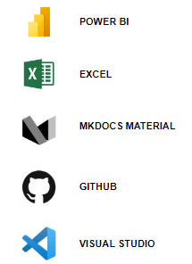

{ width=95%}

!!! tldr "Links de acesso ao Dashboard"
    - :chart_with_upwards_trend: &nbsp; **App Power BI :** [Dashboard Vendas](https://app.powerbi.com/view?r=eyJrIjoiYzBhZGY2YTgtMWJhYi00NDQxLWFkZGYtZmRiZGFjMTQ2MWJhIiwidCI6ImJhYzMzYTFiLTdlMDAtNGM1Ni1hNTc2LWQwMGZlMjYxNTg2MiJ9&pageName=ReportSection);
    - :file_folder: &nbsp; **GitHub:** [Repositório Dashboard Vendas](https://github.com/KlemersonGomes/dashboard_vendas.git);
    

## __Objetivo__

Esse Dashboard têm por objetivo principal auxiliar a 
área de vendas da loja DB Sales a entender melhor
o comportamento das suas vendas através de KPIs.

## __Dados__

Os dados utilizados nesse projeto foram extraidos da [base de dados pública de vendas](https://www.kaggle.com/datasets/beekiran/sales-data-analysis) fornecida no Kaggle.

Os dados utilizados foram dados básicos e de fácil utilização e os mesmos não necessitaram de pré-tratamento.

## __Ferramentas__

Essas foram as ferramentas utilizadas para contruir todo o projeto, desde o dashboard até a documentação. 

