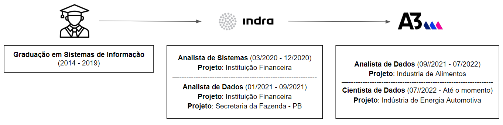

{ width=95%}

## __Sobre Mim__
??? tldr "Informações"
    - **Idade**: 27 Anos
    - **Nacionalidade**: Brasileiro
    - **Email**: klemersonsg@gmail.com
    - **Formação**: Bacharelado em Sistemas de Informações (2014 - 2019)
    - **Tempo de carreira**: Mais de 3 anos de experiência comprovada nas área de Tecnologia e Analytics (2020 - Até o Momento)

## __Carreira__

??? tldr "Analista de Sistemas - Indra Company"
    - **Tempo de Duração**: 02/2020 - 12/2020
    - **Função**: Analista de Sistemas
    - **Projeto**: Projeto Turbo - Banco Santander
    - **Atribuições**: Responsável pela sustentação de código, realizando melhorias e consertos em códigos  defeituosos que eram gerados a partir da migração de um código na linguagem Java para linguagem JavaScript.
    - **Tecnologias e ferramentas utilizadas**: 
        - Java 
        - JavaScript
        - Angular
        - HTML
        - CSS
        - SQL
        - Visual Studio
        - Git
        - Metodologia Ágil

??? tldr "Analista de Dados - Indra Company"
    - **Tempo de Duração**: 01/2021 - 09/2021
    - **Função**: Analista de Dados
    - **Projeto**: Projeto LGPD - Banco Bradesco
    - **Atribuições**: Responsável pela construção de novos dashboards gerenciais, manutenção em dashboards existentes e análise exploratória dos dados em busca de insights.
    - **Tecnologias e ferramentas utilizadas**: 
        - Power BI 
        - SQL
        - Excel
        - Metodologia Ágil

??? tldr "Analista de Dados - A3 Data"
    - **Tempo de Duração**: 09/2021 - 07/2022
    - **Função**: Analista de Dados
    - **Projeto**: Projeto Kairós - Pif Paf Alimentos
    - **Atribuições**: Responsável pela construção de novos dashboards gerenciais e operacionais, manutenção em dashboards existentes e auxilio analítico a área de negócios.
    - **Tecnologias e ferramentas utilizadas**: 
        - Power BI 
        - AWS
        - SQL
        - Python
        - Excel
        - Sharedpoint
        - MkDocs
        - Metodologia Ágil

??? tldr "Cientista de Dados - A3 Data"
    - **Tempo de Duração**: 07/2022 - Até o momento
    - **Função**: Cientista de Dados
    - **Projeto**: Projeto Zeus - Moura Baterias
    - **Atribuições**: Responsável por realizar análise exploratória dos dados em busca de insights para área de negócio com o objetivo de fomentar as vendas e diminuir custos de marketing.
    - **Tecnologias e ferramentas utilizadas**: 
        - Python
        - Jupyter Notebook
        - SQL
        - AWS
        - Linguagem R
        - Power BI 
        - Excel
        - MkDocs
        - Metodologia Ágil